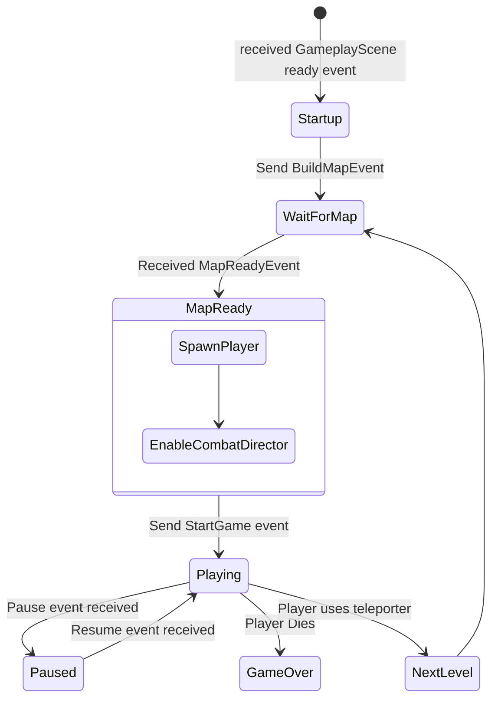

# Foxglove.Gameplay

Systems in this assembly implement the game loop of foxglove

## Game Manager State Diagram

```mermaid
stateDiagram-v2
direction TB
    [*] --> Startup : received GameplayScene ready event
    Startup --> WaitForMap : Send BuildMapEvent
    WaitForMap --> MapReady : Received MapReadyEvent
    MapReady --> Playing : Send StartGame event
    Playing --> Paused : Pause event received
    Paused --> Playing : Resume event received
    Playing --> GameOver : Player Dies
    Playing --> NextLevel : Player uses teleporter
    NextLevel --> WaitForMap
    state MapReady {
        SpawnPlayer --> EnableCombatDirector
    }
```
